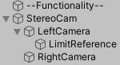
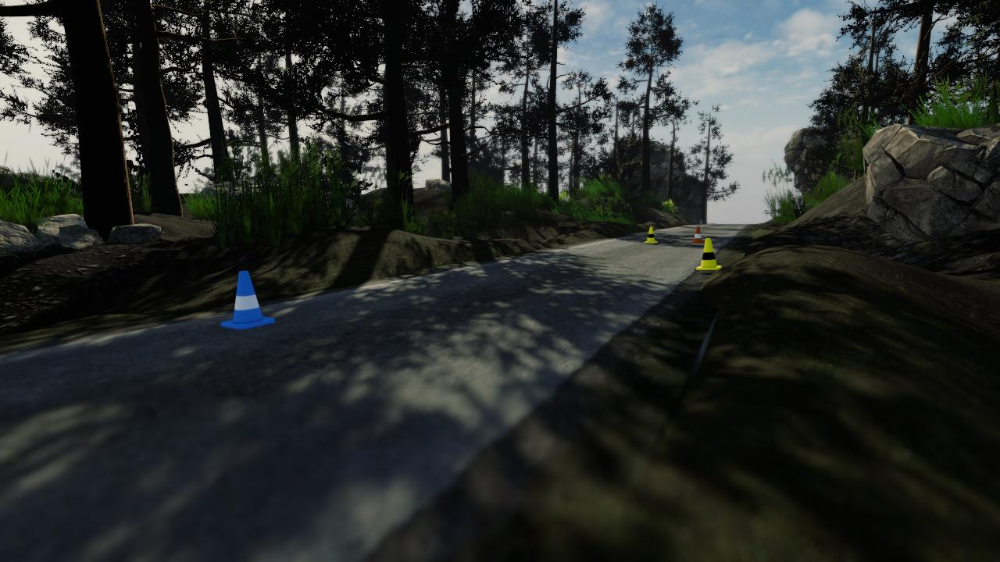
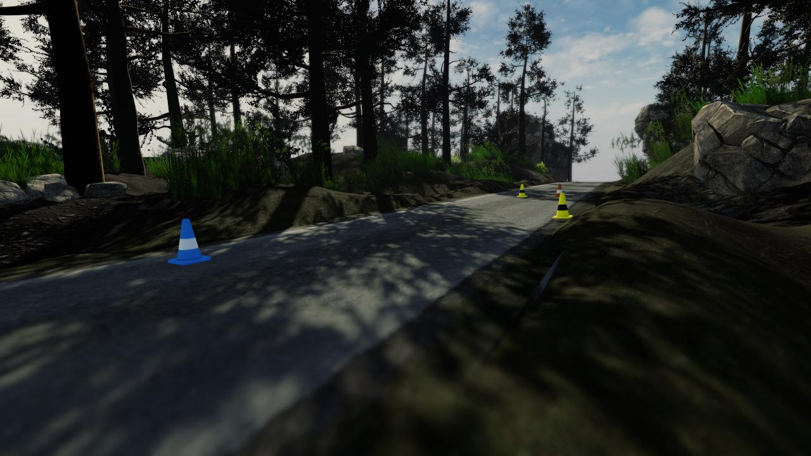

# Synthetic Cone Dataset Generator with Unity
The four scripts in this repository allow you to generate your own cone dataset with 3D information, in any version of Unity and in the scene you generate.

I also have a dataset of 1005 stereo images generated. ([SyntheticConeDataset 1005](https://drive.google.com/file/d/1LVOSLRbuit5ZqfCRxZUYPna7gSNEcelr/view?usp=sharing))

  

## :selfie:Credit
If you find this repository useful or interesting, please give me credit.
- [LinkedIn](https://www.linkedin.com/in/javier-albar%C3%A1%C3%B1ez-mart%C3%ADnez-8b0b251b3/)
- [Github](https://github.com/AlbaranezJavier)

## :bulb:Motivation
We are involved in the Formula Student competition, where the goal is to complete a series of tests with an autonomous car. These tests are delimited with a series of cones, so the agents in charge must be able to understand this type of environment.

## :checkered_flag:Objective
To have a set of data similar to reality where to test different algorithms or to test them before their implementation in a real environment.

## :factory:Design
As in the figure below, the "StereoCam" object contains two cameras and the "ConeGenerator" and "DatasetGenerator" scripts. 

  

### The "ConeGenerator" script:
Contains the cone prefabs, the number of cones generated, the reference gameobject and the limits where the cones will be generated.
### The "DatasetGenerator" script:
It has a "Debugging" boolean to check the generated cones in the Scene window, the cameras with which the images will be obtained, the reference points of the detected cones, the directory where the data set will be saved and the name of the container folder.
### The gameobject "LimitReference":
This allows to generate the cones being the camera where the coordinate system is located, so its local position must be (0,0,0).

## :bar_chart:Results
When the "p" key is pressed, two images are generated, one for each camera and the data they contain is stored in two CSVs.
### The information obtained consists of:
* id = reference of the captured image.
* type = type of cone [0=large orange, 1=small orange, 2=blue, 3=yellow].
* Bounding box 2D = (pixelx1, pixely1) and (pixelx2, pixely2) measured in pixels.
* Bounding box 3D:
  * Position (locatex, locatey, locatez) in meters and being the corresponding camera the reference system or (0,0,0).
  * Rotation (yewx, yewy, yewz) in degrees, where the x-axis marks the direction of the object and the y-axis its vertical rotation. 
  * Size (sizew, sizeh, sizel) or (width, height, length) in meters.
  

  
  

Left camera:
| **id** | **type** | **pixelx1** | **pixely1** | **pixelx2** | **pixely2** | **locatex** | **locatey** | **locatez** | **yewx** | **yewy** | **yewz** | **sizew** | **sizeh** | **sizel** |
|---|----|-------|-------|-------|-------|-------|-------|-------|-------|------|-------|-----|-----|-----|
|2  |3   |890    |304    |924    |346    |2.220  |0.269  |5.184  |352.837|30.969|0.218  |0.228|0.325|0.228|
|2  |3   |824    |290    |842    |311    |3.128  |0.935  |10.083 |352.793|30.606|357.394|0.228|0.325|0.228|
|2  |2   |279    |346    |354    |422    |-1.540 |-0.124 |2.960  |352.792|30.607|357.394|0.228|0.325|0.228|
|2  |1   |883    |289    |902    |312    |3.887  |0.885  |9.563  |352.793|30.608|357.394|0.228|0.325|0.228|

Right camera:
| **id** | **type** | **pixelx1** | **pixely1** | **pixelx2** | **pixely2** | **locatex** | **locatey** | **locatez** | **yewx** | **yewy** | **yewz** | **sizew** | **sizeh** | **sizel** |
|---|----|-------|-------|-------|-------|-------|-------|-------|-------|------|-------|-----|-----|-----|
|2  |3   |871    |304    |904    |345    |2.090  |0.277  |5.259  |352.837|30.969|0.218  |0.228|0.325|0.228|
|2  |3   |814    |290    |832    |311    |2.998  |0.943  |10.158 |352.793|30.606|357.394|0.228|0.325|0.228|
|2  |2   |261    |345    |335    |419    |-1.670 |-0.117 |3.035  |352.792|30.607|357.394|0.228|0.325|0.228|
|2  |1   |873    |290    |891    |311    |3.757  |0.893  |9.638  |352.793|30.608|357.394|0.228|0.325|0.228|

## :bookmark_tabs:Guides
1. Creation of the visual environment.
2. Adjusting the light and post-processing parameters.
3. Entering the image and data storage path. Adjusting the cone generator. Finally, adjust the size of the "Game" window to the desired resolution.
4. Execute Unity. To move the camera it is necessary to have selected the "Game" window. Movement with "a", "s", "d" and "w". Vertical displacement with "q" and "e". Rotation of the camera right click and move the mouse.
5. Once the camera is in the desired position press "g" for the generation of cones.
6. Press "p" to store the data: one image (jpg) for each camera and its information collected in its corresponding CSV.

If the folder exists, the data and images are added to the existing ones.

## :raised_hands:References
 - [Research group: CAPO](http://caporesearch.es/)
 - [Competition group: UMotorsport](http://u-motorsport.com/2019/08/19/umotorsport/)
 - [Competition: Formula Student](https://www.formulastudent.es/)
